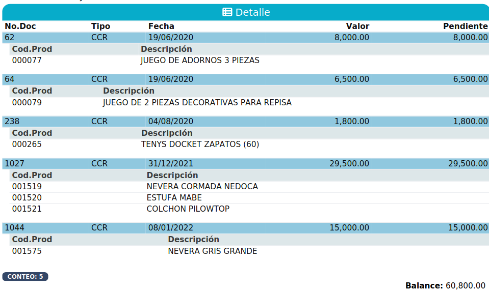
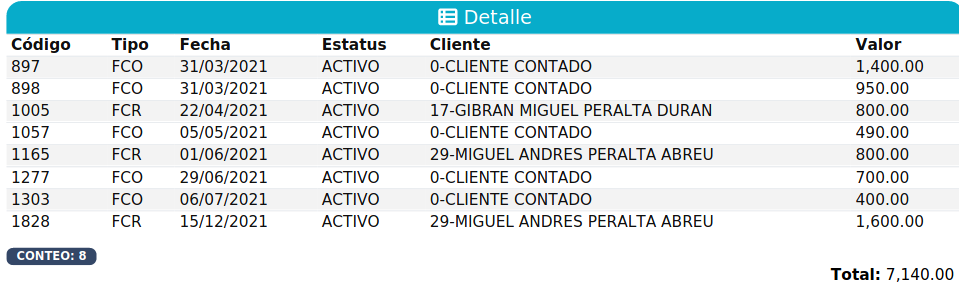
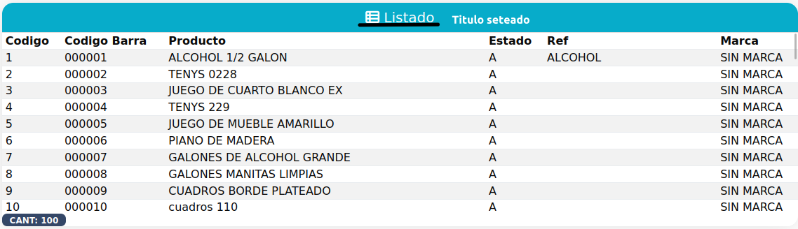

## Documentacion Tabla Python Flask.

<!-- Datos: t.Union[list, list],
               NombreColumnas: t.Union[tuple, tuple],
               DatosColumnas: t.Union[tuple, tuple],
               ClassColumnas: t.Union[tuple, tuple],
               FormatoColumnas: t.Union[tuple, bool] = False,
               TotalizarColumnas: t.Union[tuple, bool] = False,
               SubColumnasDatos: t.Union[list, bool] = False,
               SubFilas: t.Union[list, bool] = False,
               Titulo="Detalle",
               nombreClase='TablaFilas',
               idtable="table", paginacion=False, MostrarLosTH=False, MostralConteo=True, TablaNumero=0): -->

#### **Parametros**:
---
- ## **Datos (campo obligatorio)**:
    - *Tipo*: recibe una lista de json.
    ``` python
    # Ejemplo de estructura:
    [
        {'nombre': 'ALMACEN', 'estatus': 'ACTIVO'},
        {'nombre': 'SUCURSAL', 'estatus': 'INACTIVO'}
    ]
    ```
---
- ## **NombreColumnas (campo obligatorio)**:
    - *Tipo*: recibe una tupla con los nombres de cabecera de las columnas.
    ``` python
    # Ejemplo de estructura:
    ('Nombre', 'Estado')
    ```
    - *Resultado*:

    | Nombre | Estado |
    | ------ | ------ |
---
- ## **DatosColumnas (campo obligatorio)**:
    - *Tipo*: tupla.
    - *Explicacion*: recibe los nombres de los campos que tienen los datos del json de cada columna que estan en la lista del campo **Datos**.
    ``` python
    # Ejemplo de estructura:
    ('nombre', 'estatus') 
    ```
    - *Resultado*: Seria la combinacion entre este parametro y todos los anteriores.

    | Nombre | Estado |
    | ------ | ------ |
    | ALMACEN| ACTIVO |
    | SUCURSAL| INACTIVO |
---
- ## **ClassColumnas (campo obligatorio)**:
    - *Tipo*: recibe una **tupla** o un **bool** en estado Falso.
    - *Explicacion*: recibe los nombres de clases css.
    ``` python
    # Ejemplo de estructura:
    ('text-bold', 'd-none')
    ```
    - *Resultado*: El campo estatus se oculto debido a que se le colocó la clase d-none y el campo nombre se puso en negrita porque se le introdujo la clase text-bold de bootstrap.

    | Nombre  |
    | ------ |
    | **ALMACEN** |
    | **SUCURSAL**|
---
- ## **FormatoColumnas**
    - *Tipo*: recibe una **tupla** o un **bool** en estado Falso.
    - *Explicacion*: recibe los formatos que se soporta la tabla. (Este campo no es obligatorio)
    - *Formatos aceptados*: 
        - date
        - datetime
        - moneda
        - encriptar
        - zfill: Para que este formato funcione, es necesario pasar la siguiente estructura.
            - zfil_9. El _9 es el numero de ceros que se agregaran.
            (puedes poner el numero que desees). Ejemplos:
                - zfill_8. Si deseo 8 ceros.
                - zfill_6. Si deseo 6 ceros.
                - zfill_7. Si deseo 7 ceros.
    ``` python
    # Ejemplo de estructura:
    (False, False, 'zfill_6') # En este caso no deseo ningun formato en las primeras 2 columnas.
    ```
    - *Resultado*

    | Nombre | Estado | Numero |
    | ------ | ------ | ------ |
    | ALMACEN| ACTIVO | 000001 |
    | SUCURSAL| INACTIVO | 000002 |
---
- ## **TotalizarColumnas**:
    - *Tipo*: recibe una **tupla** con booleanos en estado *True* si va a totalizar, de lo contrario un **string** vacio o un **bool** en estado Falso.
    - *Explicacion*: Suma todos los valores de la columna indicada.
    ``` python
    # Ejemplo de estructura:
    ('', True, '', True)
    ```
    - *Ejemplo de los datos a totalizar*: Te devuelve una lista de json con los totales.

    | Producto | Precio | Cantidad | Total |
    | -------- | ------ | -------- | ----- |
    | Cafe     | 250.00 | 1        | 250.00 |
    | Leche    | 25.00  | 4        | 100.00 |
    | Pan      | 90.00  | 1        | 90.00 |
    - *Resultado*: Se agrega una T al inicio del nombre de cada campo.
    ``` json
    {
        "TPrecio": 365.00,
        "TTotal": 440.00
    }
    ```
---
- ## **SubColumnasDatos**:
    ``` python
    # Tenemos este query de pymongo
    producto.aggregate([
        { '$lookup': {
            'from': 'compra',
            'localField': 'idproducto',
            'foreignField': 'detalle.idproducto',
            'pipeline': [
                { '$match': {
                    '$and': [
                        {'fecha': {'$gte': args['fechaini']}},
                        {'fecha': {'$lte': args['fechafin']}},
                    ],
                    'idproveedor': args['idproveedor'],
                    'estatus': 'A'
                } },
                { '$project': {'detalle': 1, 'fecha': 1, 'idproveedor': 1, 'estatus': 1} }
            ],
            'as': 'c'
        } },
        { '$addFields': {
            'producto': '$descripcion'
        } },
        { '$project': {
            'idproducto': 1,
            'producto': 1,
            'c': 1
        } },
        { '$unwind': '$c' }
    ])
    ```
    - *Tipo*: **lista** de **tuplas** o un **string** vacio.
    - *Explicacion*: (Esta opcion solo funciona para bases de datos NoSql, y los ejemplos se haran en mongodb).
    - **La tupla recibe 3 o 4 campos**
    - *Con 4 campos*:
        - Es el alias que tiene el lookup. (en este caso 'c')
        - Es la lista que contiene los datos. (en este caso 'detalle')
        - Es el nombre del dato que se quiere obtener.
        - Si el dato del **campo 3** no tiene nada, se sustituye por este.
    - *Con 3 campos*:
        - En el caso de que no tengamos un lookup y tengamos una lista con un 'detalle' se pondra el nombre del detalle aca.
        - Es el nombre del dato que se quiere obtener.
        - Si el dato del **campo 2** no tiene nada, se sustituye por este.
---
- ## **SubFilas**:
    - *Tipo*: **Lista** de **tuplas**.
    - *Explicacion*: Las subfilas son subdatos de los datos principales que se utiliza para generar una tabla dentro de cada fila de la tabla principal con los datos especificados, y los campos requeridos para generar la subFila son los siguientes: una **lista** de **tuplas** con 3 posiciones o con 4 posiciones:
        - **Tupla 1** Recibe el nombre de las columnas.
        - **Tupla 2** Recibe el nombre de las llaves del json que tiene los datos.
        - **Tupla 3** Es donde estan los datos, ya sean de un alias de un lookup o de un campo que esta dentro del lookup.
        - **Tupla 4** Es donde se especifica el formato que se le dara a las columnas. **(Esta tupla no es obligatoria)**
    - *Ejemplo del formato*: 
        ```python
        SubFilas=[("Cod.Prod", "Descripción"),("idproducto", "descripcion"),('p'),("zfill_6",False)]
        ```
        - ### *Ejemplo de tabla con subFilas*:
        
        - ### *Ejemplo de tabla sin subFilas*:
        

---
- ## **Titulo (campo obligatorio)**:
    - *Tipo*: **string**.
    - *Explicacion*: Sirve para poner el titulo de la tabla. (si no se pone nada en este campo el titulo se sustituira por "Detalle")
    
---
- ## **nombreClase (campo obligatorio)**
    - *Tipo*: **string**.
    - *Explicacion*: Es con el nombre que se llamara en el archivo .js para la funcion **EventoSeleccionTabla**.
    - *Ejemplo*:
    ``` python
    nombreClase="TablaProveedor"
    ```
    ``` javascript
    function EventoSeleccionTabla() {
        try {
            setTimeout(function () {
                TablaProveedor(LlenarCampos); // TablaProveedor
            }, 100);
        } catch (e) {
            Notificacion.Error(e);
        }
    }
    ```
---
- ## **idtable (campo obligatorio)**:
    - *Tipo*: **string**.
    - *Explicacion*: Debe llevar el mismo nombre que el campo **nombreClase** y es el id que se le pone a la tabla en el html.
---
- ## **paginacion**:
    - *Tipo*: **bool**.
    - *Explicacion*: Sirve para poner paginacion en la tabla.
---
- ## **MostrarLosTH**:
    - *Tipo*: **bool**.
    - *Explicacion*: Cuando la tabla no trae datos, dependiendo si este campo esta en true o false, va a mostrar los nombres de las columnas o no.
---
- ## **MostralConteo**:
    - *Tipo*: **bool**.
    - *Explicacion*: Muestra la cantidad de datos que trajo o no.
